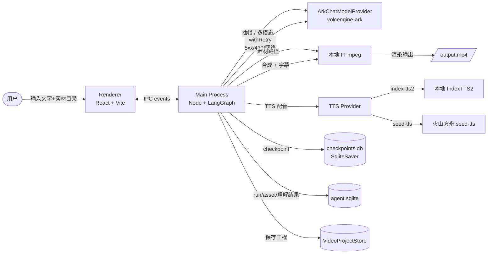

# 🎬 WiseCut · 智剪

> **从一段文字到一条成片,让 AI 替你完成"选题 → 分镜 → 配音 → 剪辑"。**

[](https://www.electronjs.org/)
[](https://react.dev/)
[](https://langchain-ai.github.io/langgraph/)
[](https://www.typescriptlang.org/)
[](./LICENSE)
[](https://nodejs.org)

---

## ✨ 这是什么

**WiseCut(智剪)** 是一款本地桌面端 AI 智能剪辑工具。

你输入一段**文字创意**(主题 / 选题 / 口播稿),AI Agent 自动完成:

```
📝 文字 → 🎬 分镜 → 🔊 配音 → 🖼️ 素材匹配 → 🎞️ 合成成片
```

整个过程在本地桌面端完成,主进程跑 LangGraph 编排,渲染层是 React + Vite,本地 FFmpeg 渲染成片,**数据不出端**。

### 🎯 核心场景

- **口播短视频运营**:"我要做一期讲 XX 的口播" → 一条带字幕、配音、素材的成片
- **选题快速试错**:"这个选题行不行" → 30 秒拿到一版可预览的分镜 + 配音
- **本地素材复用**:`~/Videos/教程素材/` 扔进去,Agent 看着素材画面内容拆分镜、找匹配
- **断点续跑**:跑一半关掉再开,LangGraph checkpoint 还在,接着跑不用从头来

---

## 🏗️ 架构



**关键隔离**:`checkpoints.db`(LangGraph 状态)和 `agent.sqlite`(运行历史 / 资产元数据 / 多模态理解)是**两个独立文件**,前者跟 LangGraph 一起,后者跟应用一起,互不耦合。

**渲染层 ↔ 主进程** 通过类型化 IPC channel(`video-agent-ipc.ts`)通讯,所有事件用 `sequence` 单调递增,前端按时间序列重组 timeline。

---

## 🌟 亮点

### 🧠 多模态分镜 — Agent 看着素材画面拆分镜

- 抽帧(ffmpeg 抽 N 帧均匀代表)→ 用户选代表帧 → 多模态 LLM 看帧 + 创作意图
- 多模态结果(mood / suggestedSceneType / promptMatchScore)直接喂给 plan_scenes 节点
- **结果持久化到 `asset_understandings` 表** — 重启后不重复调用 LLM,节省 token + 时间
- **LLM 知道每个素材实际在讲什么**,拆分镜时 visualIntent 落到具体素材,不是凭空写

### 🔁 闭环反馈 + 断点续跑

- **场景 reject 带 feedback 跳回 `plan_scenes` 节点重跑**(LangGraph 1.x `Command({ goto })`),不重头跑
- **SqliteSaver 持久化 checkpoint 到 `checkpoints.db`** — App 重启 / 崩溃后能 resume,不用从头来
- 跑完再 interrupt 等确认 → 满意就 continue,不满意再改,**整条 run 不会死**

### 🛡️ 鲁棒性 — 5xx/429/网络抖动都不怕

- `withRetry` 统一包装 LLM 调用:**指数退避 + 抖动**,默认重试 2 次
- 只重试**可重试错误**(HTTP 5xx、429、网络错误、timeout),**业务错误不重试**(JSON parse 失败、Zod 校验失败、空返回)
- 全部参数可注入,单测用 `setTimeout` 桩覆盖,无需 sleep

### 🔐 API Key 加密 + 配置中心化

- **API Key 走 Electron `safeStorage` 加密落盘**(用 OS Keychain / DPAPI),不再写 `.env`
- 其他 3 个常量(`BASE_URL` / `LLM_MODEL` / `TTS_MODEL`)在 `main.ts` hardcode,无需用户填
- 首次启动会引导用户在 onboarding 面板里填 Key,后续只读不打扰

### 🧹 内存治理 — 跑完不漏

- Run 终态(`completed` / `failed` / `cancelled`)自动清理 in-memory `runState`(`cleanupRunState`)
- 渲染端 Zustand store 用 **FIFO 容量上限**(`MAX_RETAINED_RUNS=20`)防止老 run 累积
- **per-runId snapshot 缓存**:别 run 的 event 不会触发当前 run 的 re-render
- `app.before-quit` 钩子主动 `close()` sqlite 连接,不依赖 GC

### 🎞️ 短源自动 Loop — 编辑器预览 + 导出都正确

- 源视频比分镜短(5s 源 + 8s 分镜)?自动 loop 填满
- 导出走 ffmpeg `-stream_loop -1`,编辑器预览走 HTML5 `<video>` mod loop
- 两条路径语义一致,**不会**出现"导出的正常、编辑器卡最后一帧"

### 📐 规范工程化 — commit 严格,代码自动 format

- commitlint 强制 conventional commits(scope 限定 9 个)
- pre-commit hook 跑 prettier(只对 staged 文件,**不引入 lint-staged 依赖**)
- monorepo 拆分 `apps/desktop` + `packages/video-agent` + `packages/video-project`
- LangGraph 测试覆盖完整链路:`start → interrupt → resume → 完成` + `reject → 重跑 → 再 interrupt`

### 🎛️ 实时协作 UI

- chat 流式推 `model.stream.delta`,打字机效果
- 4 阶段进度:01 准备 → 02 分镜 → 03 配音 → 04 视频
- 阶段 status `waiting` 时 UI 自动高亮"待确认"

---

## 🚀 安装使用

### 方式一：直接下载（推荐）

前往 [GitHub Releases](https://github.com/Jice19/wise-cut/releases) 下载对应平台的安装包：

| 平台    | 文件                    | 说明                    |
| ------- | ----------------------- | ----------------------- |
| macOS   | `wise-cut-darwin-*.zip` | 解压后拖入 Applications |
| Windows | `wise-cut-*.exe`        | 双击安装                |

> **macOS 首次打开提示"已损坏"？** 执行 `xattr -cr /Applications/AI智能剪辑平台.app`

### 方式二：从源码构建

<details>
<summary>点击展开</summary>

#### 环境要求

- **Node.js** `>=22 <23`
- **pnpm** `>=10.29.2`
- **macOS** 或 **Windows**

#### 步骤

```bash
git clone https://github.com/Jice19/wise-cut.git
cd wise-cut
pnpm install
pnpm run dev:desktop
```

Windows 用户需要自行下载 [FFmpeg](https://ffmpeg.org/download.html) 并将 `ffmpeg.exe` / `ffprobe.exe` 放到 `apps/desktop/bin/win32/` 目录。

</details>

### 首次使用：配置 API Key

启动后弹出 **API Key 配置面板**，需要填入 [火山方舟](https://www.volcengine.com/product/ark) 的 API Key：

1. 注册火山方舟账号 → 开通 `doubao-seed-2-0-pro-260215` 模型（支持多模态）
2. 创建 API Key → 粘贴到配置面板
3. Key 会被 `safeStorage` 加密存储到本地，**不需要** `.env` 文件

> 想修改 Key？首页底部有"API Key 配置"入口，点击修改即可。

---

## 📁 项目结构

```
wise-cut/
├── apps/
│   └── desktop/                          # Electron 桌面端(主进程 + 渲染层)
│       ├── client/                       # 主进程脚本
│       │   ├── main.ts                   # 入口 + agentDatabase 生命周期
│       │   ├── video-agent-ipc.ts        # 类型化 IPC 控制器(runState 内存治理)
│       │   ├── video-agent-tools.ts      # LangGraph 工具实现
│       │   ├── agent-database-helpers.ts # asset_understandings upsert/find
│       │   ├── api-config-store.ts       # safeStorage 加密 API Key
│       │   └── video-export-ffmpeg.ts    # ffmpeg 命令拼装 + -stream_loop
│       ├── renderer/                     # 渲染层(React)
│       │   ├── pages/                    # 4 个页面
│       │   ├── components/agent/         # Agent 时间线 + 分镜确认 + 帧选择
│       │   ├── components/editor/        # PreviewPanel + TimelinePanel
│       │   └── stores/                   # zustand(FIFO cap + per-runId snapshot)
│       ├── shared/                       # 类型化 IPC 通道定义
│       ├── tests/                        # vitest
│       └── bin/darwin/                   # ffmpeg/ffprobe 二进制(macOS)
├── packages/
│   ├── video-agent/                      # LangGraph 编排 + Ark provider
│   │   ├── src/graph/                    # nodes / state / SqliteSaver factory
│   │   ├── src/utils/with-retry.ts       # 指数退避重试
│   │   ├── src/providers/                # ArkChatModelProvider(wrapped)
│   │   ├── src/storage/                  # agent.sqlite schema + dao
│   │   └── src/media/                    # ffmpeg 抽帧 + ffprobe
│   └── video-project/                    # VideoProject schema + 校验
└── docs/                                 # 设计与需求文档
```

---

## 🛠️ 开发指南

<details>
<summary>点击展开</summary>

### 跑测试 + 类型检查

```bash
# 全量测试
pnpm test

# 跑 TSC(应该 0 个错)
pnpm exec tsc --noEmit -p apps/desktop/tsconfig.json
pnpm exec tsc --noEmit -p packages/video-agent/tsconfig.json

# 跑指定模块的测试
pnpm exec vitest run packages/video-agent/tests/with-retry.test.ts
pnpm exec vitest run apps/desktop/tests/agent-run-cleanup.test.ts
```

### Commit 规范

**强制 conventional commits**,scope 限定:

| Scope         | 用途                             |
| ------------- | -------------------------------- |
| `agent`     | LangGraph / 多模态 / provider    |
| `desktop`   | 主进程 / 共享类型                |
| `editor`    | 编辑器 / PreviewPanel / Timeline |
| `electron`  | Electron 配置 / 打包 / hook      |
| `export`    | ffmpeg / 视频导出                |
| `project`   | VideoProject schema              |
| `renderer`  | React 组件 / store               |
| `tts`       | 配音 / IndexTTS2 / seed-tts      |
| `workspace` | 工作区 / 创建流程                |

**`subject-case` 全小写**(`@commitlint/config-conventional` 默认规则)— 中文 / 英文 / 数字都行,**不要首字母大写**。例如:

```bash
# ✅ 通过
git commit -m "feat(agent): sqlite checkpoint + 持久化多模态理解结果"
git commit -m "perf(agent): llm 调用 withretry 包装 5xx/429/网络错误重试"

# ❌ 被 husky 拒(subject-case 违反)
git commit -m "perf(agent): LLM 调用 withRetry 包装"
```

### 跑指定测试

```bash
# 单文件
pnpm exec vitest run packages/video-agent/tests/with-retry.test.ts

# 跟 IPC 相关的(desktop)
pnpm exec vitest run apps/desktop/tests/{create-agent-flow,video-agent-tools,scene-regeneration-conversation,keyframes-message}.test.ts

# video-agent 全量(目前 64/64 过)
pnpm exec vitest run --project video-agent
```

### Pre-commit Hook

`.husky/pre-commit` 自动对 staged 文件跑 prettier(用本地 `node_modules/.bin/prettier`,**不引入 lint-staged 依赖**),改完自动 `git add -u`。

`.husky/commit-msg` 跑 `npx commitlint --edit`,scope 不在白名单 / subject-case 违反会被拒。

### TSC 验收

`tsc --noEmit` 应该 **0 错**。任何 pre-existing 错误都视为"欠债",修代码时顺手清掉。

### 数据文件位置

Electron `app.getPath('userData')` 下,会随平台而变:

| 平台    | 路径                                        |
| ------- | ------------------------------------------- |
| macOS   | `~/Library/Application Support/wise-cut/` |
| Windows | `%APPDATA%\wise-cut\`                     |

```
userData/
├── agent.sqlite          # 运行历史 / 资产 / 多模态理解
├── checkpoints.db        # LangGraph SqliteSaver
├── api-config.enc        # safeStorage 加密的 API Key
├── custom-voices/        # 自定义音色
└── agent-runs/           # 调试用事件 dump
```

</details>

---

## 🗺️ 路线图

### ✅ 最近完成

- [X] **SqliteSaver 替代 MemorySaver**(commit `f8a8512`):`checkpoints.db` 落盘,App 重启能 resume
- [X] **多模态理解结果持久化**:`asset_understandings` 表,`ON CONFLICT (run_id, asset_id) DO UPDATE`,启动时 hot-load
- [X] **LLM 调用指数退避重试**:`withRetry` 工具,5xx/429/网络错误自动重试,业务错误不重试(`6d64832`)
- [X] **Run 终态内存清理** + **per-runId 稳定 snapshot** + **FIFO 容量上限**(`a19ddd1`)
- [X] **`before-quit` 关闭 sqlite 连接**(`d84b41f`):不依赖 GC
- [X] **API Key 走 `safeStorage` 加密** + 首次启动 onboarding 面板(`0adeac0`),弃用 `.env`
- [X] **用户偏好(音乐/字幕)持久化到 localStorage**(`8f22d0b`)
- [X] **pre-commit hook 跑 prettier**(`705bf96`,不引入 lint-staged)
- [X] **TSC 0 错**(`3ce131a`)

### 🚧 进行中

- [ ] 单分镜编辑(从分镜方案里单独 approve/edit 某个 scene)
- [ ] 真正接通 `analyze_assets` 节点(让 graph 端到端跑通,不止依赖 IPC 路径)
- [ ] `AgentConversationTimeline` 列表虚拟化(`@tanstack/react-virtual`):长 run 不卡
- [ ] `video-agent-ipc` 7 个 channel 的集成测试(目前 0 测)

### 💡 计划

- [ ] release-please 自动生成 CHANGELOG
- [ ] 智能体 console / debug 页面(实时 dump 所有 event)
- [ ] ffmpeg 抽 extraResources(瘦身仓库 77MB)
- [ ] 真实 TTS 端到端测试(seed-tts / IndexTTS2)
- [ ] Web clip 详情 drawer(点 timeline 上的 clip 直接看 source asset + understanding)
- [ ] Workspace 多项目切换

---

## 🤝 贡献

PR 之前请:

1. 跑通 `pnpm test` 和 `pnpm exec tsc --noEmit`(应该 0 错)
2. commit message 走 commitlint 规范(否则 husky 拒收,**特别注意 subject-case**)
3. 新增功能**优先补单测**(尤其是 LangGraph 节点、工具函数、IPC 控制器)
4. 涉及性能改动,先描述 baseline → 改动 → 测量结果,别只贴 PR description

---

## 📄 许可

[MIT](./LICENSE) — 自由使用、修改、分发。

---

<p align="center">
  <sub>Built with ❤️ for content creators who want to ship faster.</sub>
</p>
