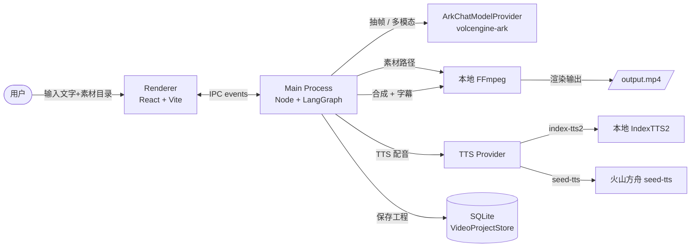

# 🎬 WiseCut · 智剪

> **从一段文字到一条成片,让 AI 替你完成"选题 → 分镜 → 配音 → 剪辑"。**

[](https://www.electronjs.org/)
[](https://react.dev/)
[](https://langchain-ai.github.io/langgraph/)
[](https://www.typescriptlang.org/)
[]()
[](https://nodejs.org)

---

## ✨ 这是什么

**WiseCut(智剪)** 是一款本地桌面端 AI 智能剪辑工具。

你输入一段**文字创意**(主题 / 选题 / 口播稿),AI Agent 自动完成:

```
📝 文字 → 🎬 分镜 → 🔊 配音 → 🖼️ 素材匹配 → 🎞️ 合成成片
```

整个过程在本地桌面端完成,主进程跑 LangGraph 编排,渲染层是 React + Vite,本地 FFmpeg 渲染成片,**数据不出端**。

### 🎯 核心场景

- **口播短视频运营**:"我要做一期讲 XX 的口播" → 一条带字幕、配音、素材的成片
- **选题快速试错**:"这个选题行不行" → 30 秒拿到一版可预览的分镜 + 配音
- **本地素材复用**:`~/Videos/教程素材/` 扔进去,Agent 看着素材画面内容拆分镜、找匹配

---

## 🏗️ 架构



**渲染层 ↔ 主进程** 通过类型化 IPC channel(`video-agent-ipc.ts`)通讯,所有事件用 `sequence` 单调递增,前端按时间序列重组 timeline。

---

## 🌟 亮点

### 🧠 多模态分镜 — Agent 看着素材画面拆分镜

- 抽帧(ffmpeg 抽 N 帧均匀代表)→ 用户选代表帧 → 多模态 LLM 看帧 + 创作意图
- 多模态结果(mood / suggestedSceneType / promptMatchScore)直接喂给 plan_scenes 节点
- **LLM 知道每个素材实际在讲什么**,拆分镜时 visualIntent 落到具体素材,不是凭空写

### 🔁 闭环反馈 — 用户改主意不用从头来

- 分镜方案不满意 → 在 chat 里写反馈 → graph 跳回 `plan_scenes` 节点重跑(带 feedback)
- 跑完再 interrupt 等确认 → 满意就 continue,不满意再改,**整条 run 不会死**
- 跟 LangGraph 1.x `Command({ goto })` 深度集成

### 🎞️ 短源自动 Loop — 编辑器预览 + 导出都正确

- 源视频比分镜短(5s 源 + 8s 分镜)?自动 loop 填满
- 导出走 ffmpeg `-stream_loop -1`,编辑器预览走 HTML5 `<video>` mod loop
- 两条路径语义一致,**不会**出现"导出的正常、编辑器卡最后一帧"

### 📐 规范工程化 — commit 严格,代码自动 format

- commitlint 强制 conventional commits(scope 限定 9 个)
- pre-commit hook 跑 prettier(只对 staged 文件,**不引入 lint-staged 依赖**)
- monorepo 拆分 `apps/desktop` + `packages/video-agent` + `packages/video-project`
- LangGraph 测试覆盖完整链路:`start → interrupt → resume → 完成` + `reject → 重跑 → 再 interrupt`

### 🎛️ 实时协作 UI

- chat 流式推 `model.stream.delta`,打字机效果
- 4 阶段进度:01 准备 → 02 分镜 → 03 配音 → 04 视频
- 阶段 status `waiting` 时 UI 自动高亮"待确认"

---

## 🚀 快速开始

### 1. 环境要求

- **Node.js** `>=22 <23`(用 volta 锁住 22.11.0)
- **pnpm** `>=10.29.2`
- **macOS** 或 **Windows**(开发态跨平台)
- 真实运行的 **ffmpeg + ffprobe**(本仓库 `apps/desktop/bin/darwin/` 已带 macOS 二进制,Windows 自备或下载)

### 2. 克隆 & 安装

```bash
git clone https://github.com/Jice19/wise-cut.git
cd wise-cut
pnpm install
```

### 3. 配置 `.env`

仓库根目录创建 `.env`(**已经在 `.gitignore` 里,别提交**):

```bash
LLM_MODEL=doubao-seed-2.0-pro
TTS_MODEL=seed-tts-2.0
BASE_URL=https://ark.cn-beijing.volces.com/api/plan/v3
API_KEY=<你的火山方舟 Ark API Key>
```

> 在 [火山方舟控制台](https://www.volcengine.com/product/ark) 申请 Key,模型选 `doubao-seed-2-0-pro-260215`(支持多模态)。

### 4. 启动开发模式

```bash
pnpm run dev:desktop
```

Electron 窗口起来,会进入**工作区 → 创建 → 编辑器**三屏流程。

### 5. 跑测试 + 类型检查

```bash
# 全量测试
pnpm test

# 跑 TSC(应该 0 个错)
pnpm exec tsc --noEmit -p apps/desktop/tsconfig.json
pnpm exec tsc --noEmit -p packages/video-agent/tsconfig.json
```

---

## 📁 项目结构

```
wise-cut/
├── apps/
│   └── desktop/                          # Electron 桌面端(主进程 + 渲染层)
│       ├── client/                       # 主进程脚本
│       │   ├── video-agent-ipc.ts        # 类型化 IPC 控制器
│       │   ├── video-agent-tools.ts       # LangGraph 工具实现
│       │   └── video-export-ffmpeg.ts     # ffmpeg 命令拼装 + -stream_loop
│       ├── renderer/                     # 渲染层(React)
│       │   ├── pages/                    # 4 个页面
│       │   ├── components/agent/          # Agent 时间线 + 分镜确认 + 帧选择
│       │   ├── components/editor/         # PreviewPanel + TimelinePanel
│       │   └── stores/                   # zustand
│       ├── shared/                       # 类型化 IPC 通道定义
│       ├── tests/                        # vitest
│       └── bin/darwin/                   # ffmpeg/ffprobe 二进制(macOS)
├── packages/
│   ├── video-agent/                      # LangGraph 编排 + Ark provider
│   │   ├── src/graph/                    # nodes / state / checkpointer
│   │   ├── src/prompts/                  # 5 个 prompt builder
│   │   ├── src/providers/                # ArkChatModelProvider
│   │   └── src/media/                    # ffmpeg 抽帧 + ffprobe
│   └── video-project/                    # VideoProject schema + 校验
└── docs/                                 # 设计与需求文档
```

---

## 🛠️ 开发指南

### Commit 规范

**强制 conventional commits**,scope 限定:

| Scope       | 用途                             |
| ----------- | -------------------------------- |
| `agent`     | LangGraph / 多模态 / provider    |
| `desktop`   | 主进程 / 共享类型                |
| `editor`    | 编辑器 / PreviewPanel / Timeline |
| `electron`  | Electron 配置 / 打包 / hook      |
| `export`    | ffmpeg / 视频导出                |
| `project`   | VideoProject schema              |
| `renderer`  | React 组件 / store               |
| `tts`       | 配音 / IndexTTS2 / seed-tts      |
| `workspace` | 工作区 / 创建流程                |

例子:

```bash
git commit -m "feat(agent): 多模态理解 + 代表帧嵌入 chat 流"
git commit -m "fix(editor): preview-panel loop 短源视频,分镜后半段不再卡静态画面"
```

### 跑指定测试

```bash
# 单文件
pnpm exec vitest run components/PreviewPanel.test.tsx

# 跟 IPC 相关的(desktop)
pnpm exec vitest run tests/{create-agent-flow,video-agent-tools,scene-regeneration-conversation,keyframes-message}.test.ts
```

### Pre-commit Hook

`.husky/pre-commit` 自动对 staged 文件跑 prettier(用本地 `node_modules/.bin/prettier`,**不引入 lint-staged 依赖**),改完自动 `git add -u`。

### TSC 验收

`tsc --noEmit` 应该 **0 错**。任何 pre-existing 错误都视为"欠债",修代码时顺手清掉。

---

## 📦 打包发布

```bash
# macOS .dmg
pnpm run package:mac
pnpm run make:mac

# Windows .exe (Squirrel)
pnpm run package:win
pnpm run make:win

# 同时打两个
pnpm run make
```

产物在 `apps/desktop/out/`。

> **ffmpeg 体积**:`apps/desktop/bin/darwin/ffmpeg` 77MB 跟仓库走(没拆 extraResources,GitHub 100MB 限额内)。后续会改 electron-builder 抽到 `extraResources` 瘦身仓库。

---

## 🗺️ 路线图

### ✅ 已完成

- [x] **Step 1** 抽帧(ffmpeg 均匀抽 N 帧 + 推到 chat 流)
- [x] **Step 2** 多模态理解(doubao-seed-2-0-pro 看代表帧 + 创作意图)
- [x] **Step 3** 分镜规划(plan_scenes prompt 接 sourceAssets,LLM 看到素材画面内容)
- [x] **creative_brief + match_assets** 也合并多模态结果
- [x] **scene_approval reject 路径**(带 feedback 跳回 plan_scenes 重跑)
- [x] **编辑器 PreviewPanel loop 短源视频**(mod loop,跟 ffmpeg export 一致)
- [x] **pre-commit hook 跑 prettier**(不引入 lint-staged)
- [x] **TSC 0 错**

### 🚧 进行中

- [ ] 单分镜编辑(从分镜方案里单独 approve/edit 某个 scene)
- [ ] 真正接通 `analyze_assets` 节点(让 graph 端到端跑通,不止依赖 IPC 路径)

### 💡 计划

- [ ] 多模态失败重试(指数退避,生产更稳)
- [ ] CHANGELOG 自动生成(release-please)
- [ ] 智能体 console / debug 页面(实时 dump 所有 event)
- [ ] ffmpeg 抽 extraResources(瘦身仓库 154MB)
- [ ] 真实 TTS 端到端测试(seed-tts / IndexTTS2)

---

## 🤝 贡献

PR 之前请:

1. 跑通 `pnpm test` 和 `pnpm exec tsc --noEmit`(应该 0 错)
2. commit message 走 commitlint 规范(否则 husky 拒收)
3. 新增功能**优先补单测**(尤其是 LangGraph 节点和工具函数)

---

## 📄 许可

Private & Confidential.

---

<p align="center">
  <sub>Built with ❤️ for content creators who want to ship faster.</sub>
</p>
